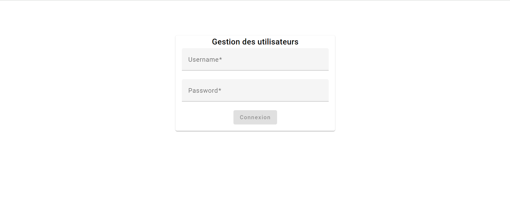
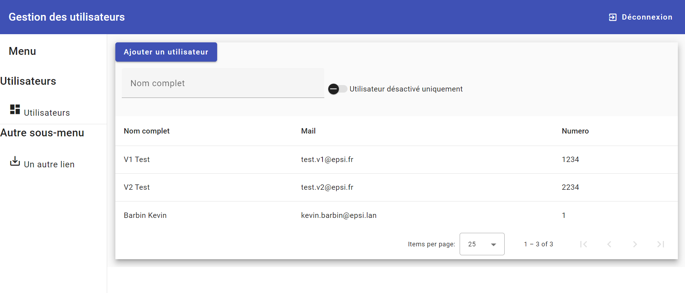

## TD Angular
TD 1 à 7 pour la prise en main d'Angular réalisé par Kévin Barbin.

# Consignes d'éxécution
1) Effectuer un gitclone `https://github.com/Lingatsu/td-angular.git`
2) Faites un `git checkout td7` si vous souhaitez vous placer sur la branche correspondant au dernier td.
3) Ecrivez `ng serve --open` dans le command line pour lancer l'application
4) Naviguez à l'url `http://localhost:4200/`
5) Ecrivez un login et un password aléatoire

# Résultat Final

# IdentityManagement

This project was generated with [Angular CLI](https://github.com/angular/angular-cli) version 16.2.0.

## Development server

Run `ng serve` for a dev server. Navigate to `http://localhost:4200/`. The application will automatically reload if you change any of the source files.

## Code scaffolding

Run `ng generate component component-name` to generate a new component. You can also use `ng generate directive|pipe|service|class|guard|interface|enum|module`.

## Build

Run `ng build` to build the project. The build artifacts will be stored in the `dist/` directory.

## Running unit tests

Run `ng test` to execute the unit tests via [Karma](https://karma-runner.github.io).

## Running end-to-end tests

Run `ng e2e` to execute the end-to-end tests via a platform of your choice. To use this command, you need to first add a package that implements end-to-end testing capabilities.

## Further help

To get more help on the Angular CLI use `ng help` or go check out the [Angular CLI Overview and Command Reference](https://angular.io/cli) page.

